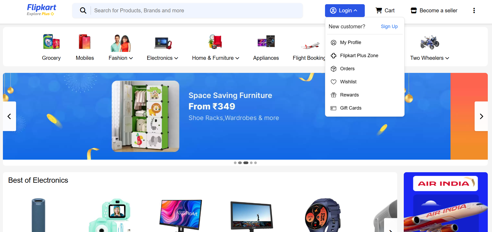
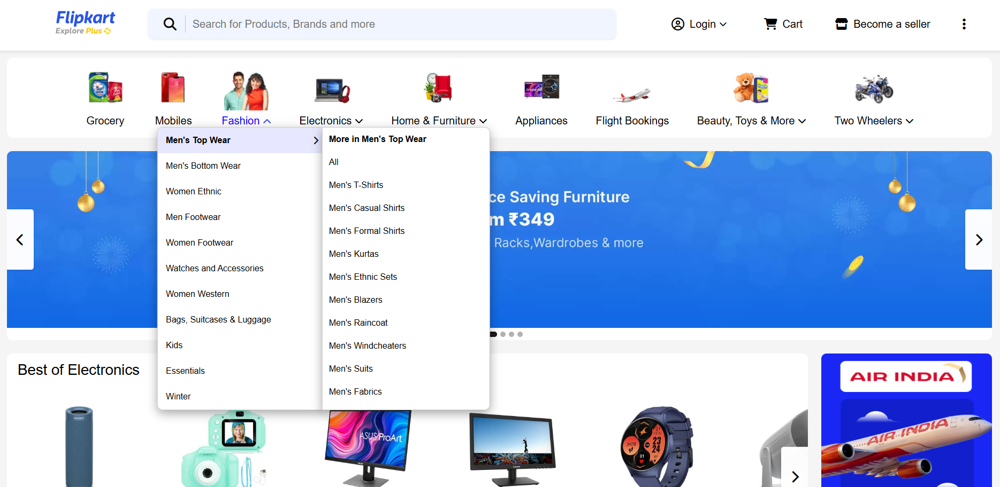
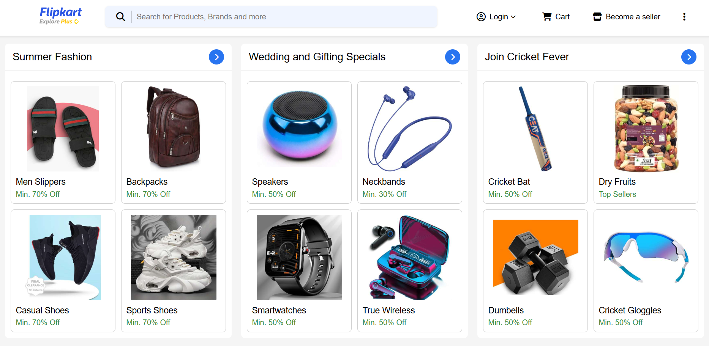

# Flipkart Clone

A responsive web-based clone of Flipkart's user interface, built with HTML, CSS, and JavaScript.

## Features

- Responsive design that works on desktop and mobile
- Product listing and details pages
- Shopping cart functionality
- User authentication interface
- Search functionality

## Technologies Used

- HTML5
- CSS3
- JavaScript
- Modern UI/UX principles

## Getting Started

1. Clone the repository:
   ```bash
   git clone https://github.com/Tushar-revankar/Flipkart-clone.git
   ```

2. Open `index.html` in your web browser to view the project.

## Project Structure

```
flipkart-clone/
├── index.html
├── css/
│   ├── main.css
│   ├── header.css
│   ├── shop-category.css
│   └── style.css
├── js/
│   ├── main.js
│   ├── banner-slider.js
│   └── header.js
├── images/
│   ├── electronics/
│   ├── toys-more/
│   ├── hero-banner/
│   ├── shop-category/
│   ├── header/
│   ├── favicon/
│   ├── screenshots/
│   ├── furniture-deals/
│   └── grid-item/
└── README.md
```

## Screenshots

### Home Page


### Category Dropdown


### Product Listings



## Contributing

Pull requests are welcome. For major changes, please open an issue first to discuss what you would like to change.

## License
